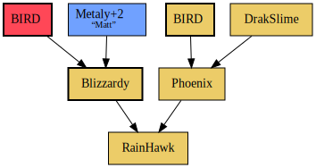

= Dragon Warrior Monsters 2 Breed Planner

Generate breed plans for Dragon Warrior Monsters 2: Cobi from text
input.

== Input format

The input file is organized by lines. Each line is either a breed
formula, a monster description, a comment (started with `#`) or empty.
The order of lines is arbitrary.

=== Breed formula

A breed formula is in the form of “A + B = C”, where “A”, “B”, and “C”
are monsters. This means a base monster A and a mate monster B are
bred into monster C. The space or tab around `+` and `=` are mandatory
(but you can write multiple spaces or tabs in each of the places).

The “A”, “B”, and “C” are called monster specs. An example of a
complete monster spec is this:

----
Slime(F)+4/1
----

There are 4 parts in a monster spec. The first part of the spec is the
kind of the monster; in this example it is a slime. The second part,
`(F)`, denotes the sex. This is a female slime. The `+4` is the plus
level requirement for this monster. It means this slime must be at
least +4 in order to make the breed work. The last part, `/1` is the
index of the monster. This is necessary if there are multiple monsters
of the same kind and sex in the breed plan. For example, if your plan
involves two female slimes, they have to have different indices so
that the system knows they are two different slimes. If there is only
one female slime in the plan, you do not need to (but you can) write
the index. It is by default 0.

In a monster spec, only the kind of monster is always mandatory. The
sex part can be omitted, meaning the sex is not determined. The plus
level can be omitted, meaning there is not plus level requirement.
Lastly as I have mentioned, the index can be omitted.

In the system, a monster is uniquely defined by its kind, sex, and
index, but not the plus level. This means if in the file you have
`Slime/1`, and `Slime+2/1`, they are considered the same slime (which
is a +2). The plus level is always taken to be the highest defined for
the same monster, therefore if you have a `Slime+1` and `Slime+2` in a
file, this slime is a +2.

Consider the following file:

----
Slime(M) + Slime(F) = Slime
Slime+4 + Slime/1 = KingSlime
----

How many slimes are there (not counting the kingslime)? The answer is
4:

* A male slime
* A female slime
* A +4 slime of undetermined sex, bred from the two slimes above. This
  is the base in the kingslime breed.
* Another slime of undetermined sex. This is the mate in the kingslime
  breed.

=== Monster description

A monster description is in the form of “M: bla”, where “M” is a
monster spec, and “bla” is the in-game name (given by the player) of
the monster. For now this is only used to give names to monsters.
Therefore one can write

----
Slime(M): Slash
Slime(M) + Slime(F) = Slime
----

which means the male slime is named “Slash”, which is used to breed
another slime. The name is shown in the generated graph.
